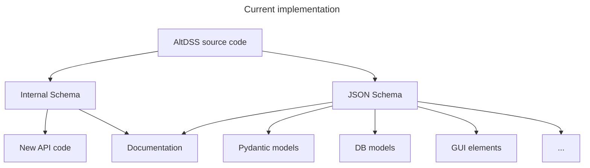
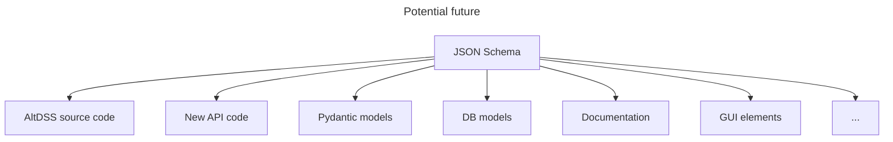

# AltDSS Schema

*Since a lot of features require DSS-Extensions to achieve good performance, we will refer to the alternative implementation of OpenDSS from DSS-Extensions.org as **AltDSS**. We hope that the AltDSS moniker should be enough to warn users that this is not an EPRI product nor supported by the upstream OpenDSS developers.*

This is a proposal for an alternative schema, encoded in JSON Schema, for representing OpenDSS circuits.

During the prototype phase, we will focus on a Python implementation to test and finalize all remaining details (some listed below). The prototype essentially converts the data from the proposed schema to the native DSS script representation.

When the prototype phase is over:
- For DSS-Extensions/AltDSS, we will have support built-in. This will enable better performance and customization. As of 2023-12-13, DSS C-API 0.14.0b1 already supports exporting and importing whole circuits as JSON, including lossless roundtrip for non-scripting data.
- For supporting the official OpenDSS (Windows-only as-of 2023-09-17), the data will be converted to DSS scripts on-the-fly. Alternatives will also be evaluated using future tools from DSS-Extensions that better integrate with the official engine (both official OpenDSS COM and ODD.DLL).

CURRENTLY, this is not intended as a full (de)serialization solution. It might evolve to that in a future update.

## Motivation

OpenDSS is very versatile, giving users a lot of freedom when providing data. It is an engineering tool and users must be wary of that when interacting with it, especially unfamiliar users. A formalized, more restricted subset of the OpenDSS data model could be used to achieve several goals:

- Manipulation of large scale systems
- Generated scenarios
- Conversion from/to other formats
- Uniform processing
- Regardless of the OpenDSS format, users still prefer to keep the data in other formats, generating DSS scripts as a subproduct, not as the main storage.
- Avoid rewriting (limited, sometimes buggy) parsers to handle DSS scripts
- Allow more programming languages to consume and produce DSS circuits more easily.

### Related tools

...

## Brief history

...

- Refactoring the property system
- Initial JSON tests
- Include more metadata
- This proposal
    - Even more metadata
    - Experimental export of the internal schema as a JSON Schema
    - Extract the default values
    - Specification sets
    - Implement property tracking in the engine to disambiguate definitions, e.g. Load (kW and PF) vs. (kW and kvar)
    -

# Proposal: community-oriented, unified OpenDSS data model

*This is **not** an EPRI product.*

This documents contains a proposal for a community-managed project to handle common issues found across many projects that need to handle OpenDSS data. Initially, this proposal encompasses only the input data. A future revision may also include output data.

...

## Current progress and issues

...

### General representation

A long term goal is to develop a unified schema for all circuit formats, with different concrete representations of some of the concepts not fully specified in JSON.

- Actions: action-like properties and the `like` property are marked `writeOnly`. This indicates that filling when providing values for these properties, the users cannot expected for them to be present after the circuit is loaded ("compiled" in DSS terms). The effects of the actions are carried when the objects are materialized, potentially changed other properties. For third-party tools processing data, the properties could be processed.

- `readOnly`: some output properties (function-like) are marked read-only. For external data manipulation, without direct interaction with the engine, it might be better to completely remove the related properties to avoid misinterpreting the data as input.

- Enumerations: currently only the values as present in the DSS language are included due to the limited representation in the JSON Schema standard. For JSON, this seems appropriate.

### Circuit: the root object

The circuit contains:

- the circuit name
- `preCommands` and `postCommands`: lists of legacy DSS commands as plain strings
- a dedicated list for each DSS object type, named by the class name (singular)
- in the future, a settings/options object
- `circuitVSource`: the properties for the `Vsource` created automatically by the circuit.

and the properties for the `Vsource` object it creates.

Initially, the plan was to included all `Vsource` properties to simplify the hierarchy of the file. But there is already a property (`spectrum`) that would conflict with the `Spectrum` objects and more properties could be added down the line.

#### Why is the circuit the root object?

Although OpenDSS has the concept of `ActiveCircuit` and could technically allow multiple circuits per OpenDSS instance, the experience on DSS-Extensions with multiple DSS instances per process seem to indicate that keeping a one-to-one match is enough for the majority of users. Instead of multiple circuits, we prefer to allow multiple instances of the DSS engine.

Further developments include a new Python API is under development that reflects this one circuit approach better, merging concepts from DSS-Python (which mimics the OpenDSS COM API) and OpenDSSDirect.py, while dropping some legacy annoyances. DSS-Python and OpenDSSDirect.py will continue to exist in parallel, but modern features will target the new API in order to avoid breaking legacy user code.

### Commands and options

Currently, the general options/settings are not exposed in a structured way, but there is work-in-progress to achieve that soon.

For the time being, there are two containers (`preCommands` and `postCommands`) for plain strings to be used as DSS commands in the main Circuit object to run commands before the circuit creation population, and after its population. These two lists are expected to remain in future revisions in order to allow using properties added later on or even new DSS objects, until there is a proper structure version of either in a future schema revision. This is required since we do not control what goes into OpenDSS in general (at most we can not port some code if we do not think it is mature/stable enough).

### Bus

Buses in OpenDSS are defined implicitly by using a bus name in the circuit components. Afterwards, the bus structures are populated. Bus coordinates, base voltages and keep list are optional. For this proposal, we added a container for these optional fields.

## JSON schema

- For extra metadata, such as the numerical indices for the properties, we shall include the `$dss` prefix, e.g. `$dssIndex` in the property list. This prefix should be enough to avoid conflict with potential new names in future JSON schema revisions.
- Property titles and descriptions can be filled as a secondary step using the message catalogs. We shall include the source commit hash for that specific catalog to allow precise tracking.

### Identifier convention

On a small sample, polled users preferred to keep the identifiers that reflect the DSS properties closer to the original DSS properties. Besides the adjustments for invalid identifiers in most languages (e.g. `%r`), users preferred keeping `PhaseVoltageReport` instead of rewriting it as `phase_voltage_report` in Python. In general, users felt that the typing information and consistent naming was good enough. 

It is important to note that a uniform identifier convention across most programming languages can save developers and users a lot of effort when creating and consuming documentation.

We also need to consider that, for many years, the default interaction with the DSS engine was through EPRI's official COM interface. For language with mature COM support, the COM interface is exposed quite close across all languages. For the interactions with OpenDSS, an example written in VBA can easily be ported to Python, C#, MATLAB, including migration to the projects under DSS-Extensions.

Personally, I (@pmeira) believe that, for example, forcing PEP8 for our Python code as a convention where it doesn't necessarily belong is short-sighted. The OpenDSS community is not large enough to justify dedicated identifier for each programming language that we create bindings for, following a potentially different convention for each one. If we ever grow enough to have multiple dedicated maintainers for each programming language, this could be revisited, but otherwise I'd say it could be a waste of effort and it can even confuse new users.

Not everything is under our control since we have to closely follow the upstream OpenDSS codebase for a lot of the decisions there, but we should strive for a convention that does not surprise users.

## Long term aspirations

Currently, the JSON schema is extracted from the internal schema using in DSS C-API (a.k.a. the AltDSS engine), which is a somewhat generalized representation of the internal OpenDSS schema.

A long term goal is to fully model the internal AltDSS schema as a JSON Schema. There is no intention of dropping compatibility with the current/classic DSS format, but this should greatly simplify maintenance of the codebase across all DSS-Extensions repositories, and hopefully help third-party projects too.

We also can investigate integrating some metadata in the C headers to ease its consumption by third-party tools.
